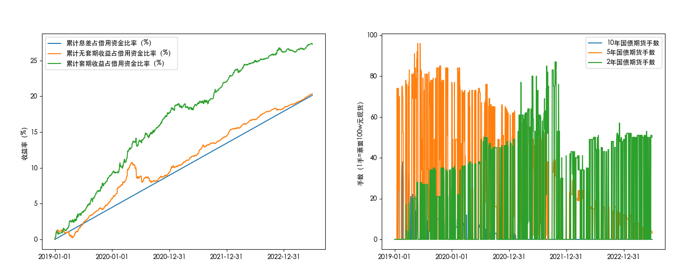

# BondHedging

A strategy to hedge against the net present value volatility risk of bonds.

The strategy is done during FICC summer internship in 2023 at HTSC.

The main PnL of backtest is shown as follows.

